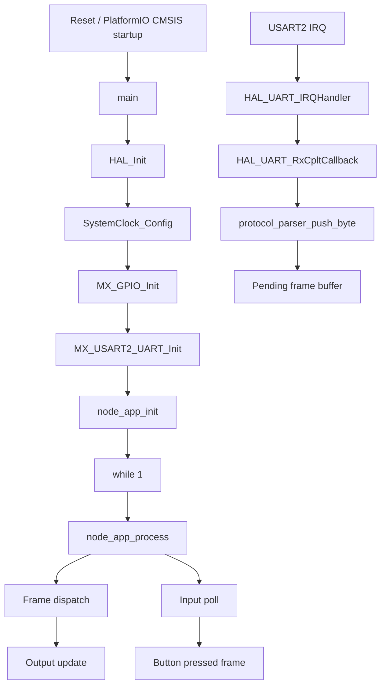

# Client Firmware Code Flow

This document describes the current runtime behavior of the node firmware in `src/client`.

## Scope

The active node firmware is built by PlatformIO from:

- `src/client/main.c`
- `src/client/node_app.cpp`
- `src/client/node_bus.cpp`
- `src/client/node_inputs.cpp`
- `src/client/node_outputs.cpp`
- `src/client/stm32f0xx_hal_msp.c`
- `src/client/stm32f0xx_it.c`
- `include/client/main.h`
- `include/client/node_app.h`
- `include/client/node_bus.h`
- `include/client/node_config.h`
- `include/client/node_inputs.h`
- `include/client/node_outputs.h`
- `include/client/stm32f0xx_it.h`

Shared STM32 configuration comes from:

- `config/stm32/stm32f0xx_hal_conf.h`
- `ldscripts/STM32F070C6Tx_FLASH.ld`
- PlatformIO-managed STM32Cube/CMSIS packages

The archived STM32CubeMX export remains under `legacy/cubemx/client`, but it is no longer part of the active build.

The implemented behavior is centered around UART receive interrupts on `USART2`, the shared protocol parser in `include/shared/protocol.h`, and separate bus/input/output modules.

## Module Map

- `src/client/main.c`: boot sequence and handoff into `node_app`
- `include/client/main.h`: output and RS485 pin definitions
- `src/client/node_app.cpp`: application orchestration
- `src/client/node_bus.cpp`: UART receive callback and RS485 transmit path
- `src/client/node_inputs.cpp`: local button GPIO init and debounce
- `src/client/node_outputs.cpp`: output ID to GPIO mapping
- `src/client/stm32f0xx_it.c`: `USART2_IRQHandler()` forwarding into HAL
- `src/client/stm32f0xx_hal_msp.c`: GPIO, UART pin mux, and NVIC setup

## High-Level Runtime Flow



## Startup Flow

### 1. Reset and HAL startup

The PlatformIO STM32Cube startup code enters `main()`, then `HAL_Init()` sets up the HAL runtime and tick source.

### 2. Clock and peripheral configuration

`SystemClock_Config()` selects HSI with no PLL. The code then initializes:

- GPIOC, GPIOA, and GPIOB clocks
- three output pins
- one RS485 transmit-enable pin
- `USART2` at `115200`, `9` data bits, even parity, `1` stop bit

### 3. Handoff into application code

After peripheral init, `main()` calls `node_app_init(&huart2)`, then stays in a forever loop that repeatedly calls `node_app_process()`.

## `node_app` Flow

`node_app_init()`:

1. initializes the node output module
2. initializes the optional local input module
3. initializes the node bus module and arms one-byte interrupt-driven UART reception

`node_app_process()`:

1. applies one pending received frame, if available
2. polls for a debounced local button press, if inputs are enabled
3. sends a `PROTOCOL_CMD_BUTTON_PRESSED` frame when a local press is detected
4. delays for 10 ms before the next polling iteration

## UART Receive Flow

The receive path spans three layers.

### Layer 1: Peripheral interrupt

`USART2_IRQHandler()` in `stm32f0xx_it.c` calls `HAL_UART_IRQHandler(&huart2)`.

### Layer 2: HAL completion callback

When one byte has been received, HAL calls `HAL_UART_RxCpltCallback()` in `node_bus.cpp`.

This function:

- verifies the callback came from the initialized UART handle
- feeds the byte into the shared parser from `include/shared/protocol.h`
- stores the completed frame into a pending-frame slot
- rearms `HAL_UART_Receive_IT()` for the next byte

### Layer 3: Framing state machine

The framing protocol is shared between controller and node firmware:

```text
0xAA | length | checksum | command | payload...
```

`protocol_parser_push_byte()` owns the receive state machine and CRC validation.

## Message Dispatch

Once a frame is complete, `node_app_process()` dispatches it.

Current command behavior:

- `PROTOCOL_CMD_SET_OUTPUT_STATE` with a 3-byte payload is accepted
- payload byte 0 must match `NODE_ID`
- payload byte 1 selects the output ID
- payload byte 2 selects the output state

The actual GPIO write is isolated in `node_outputs.cpp`.

## Pin-Level Behavior

From `main.h`, the node exposes:

- `Output_1_Pin`: GPIOC pin 13
- `Output_2_Pin`: GPIOB pin 9
- `Output_3_Pin`: GPIOB pin 8
- `RS485_TX_EN_Pin`: GPIOB pin 10

Application code touches those outputs through `node_outputs.cpp`, and manages RS485 transmit direction in `node_bus.cpp`.

## Known Constraints In The Current Flow

- only one pending frame is buffered at a time
- the node currently implements output control and button-pressed reporting only
- there is still no acknowledgement or retry model on the bus
