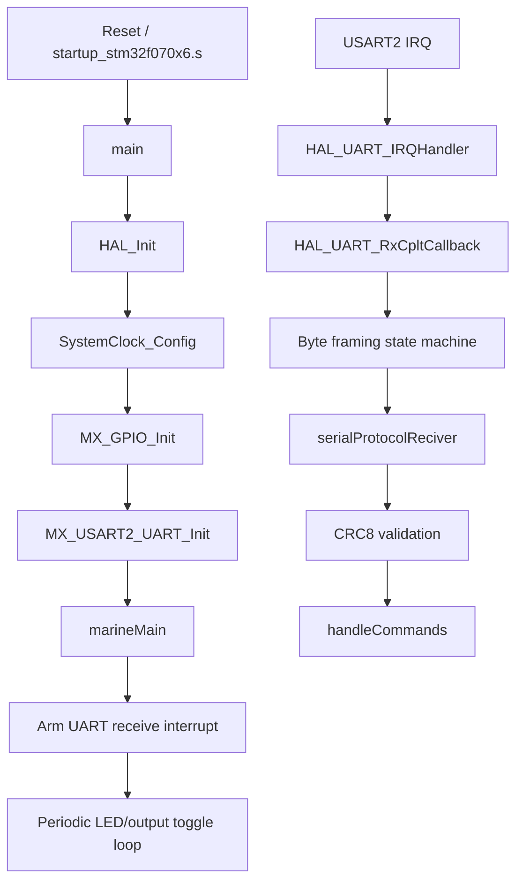

# Client Firmware Code Flow

This document describes the current runtime behavior of the client firmware in `projects/client`.

## Scope

The client project combines STM32CubeMX-generated startup code with one application module:

- `Core/Src/main.c`
- `Core/Src/marine_controller.cpp`
- `Core/Inc/marine_controller.h`

The implemented behavior is centered around UART receive interrupts on `USART2` plus a simple message parser in `marine_controller.cpp`.

## Module Map

- `Core/Src/main.c`: boot sequence, GPIO/UART init, handoff into `marineMain()`
- `Core/Inc/main.h`: output and RS485 pin definitions
- `Core/Src/marine_controller.cpp`: protocol comments, startup loop, UART receive callback, CRC check, command dispatch, placeholder scene handling
- `Core/Inc/marine_controller.h`: public entrypoint for `marineMain()`
- `Core/Src/stm32f0xx_it.c`: `USART2_IRQHandler()` forwarding into HAL

## High-Level Runtime Flow



## Startup Flow

### 1. Reset and HAL startup

The generated startup code enters `main()`, then `HAL_Init()` sets up the HAL runtime and tick source.

### 2. Clock and peripheral configuration

`SystemClock_Config()` selects HSI with no PLL. The code then initializes:

- GPIOC/GPIOA/GPIOB clocks
- three output pins
- one RS485 transmit-enable pin
- `USART2` at `115200`, `9` data bits, even parity, `1` stop bit

### 3. Handoff into application code

After peripheral init, `main()` calls `marineMain()`. This is the real application entrypoint for the client firmware.

## `marineMain()` Flow

`marineMain()` does not return. It owns the runtime after startup.

Current behavior:

1. Set GPIOB pin 9 high.
2. Arm a one-byte interrupt-driven receive with `HAL_UART_Receive_IT(&huart2, rx_buffer, 1)`.
3. Delay 2 seconds.
4. Set GPIOB pin 9 low.
5. Delay 2 seconds.
6. Repeat forever.

This loop acts like a heartbeat and also ensures receive is armed at least once during startup. After that, the receive callback rearms the UART on every byte.

## UART Receive Flow

The receive path spans three layers.

### Layer 1: Peripheral interrupt

`USART2_IRQHandler()` in `stm32f0xx_it.c` calls `HAL_UART_IRQHandler(&huart2)`.

### Layer 2: HAL completion callback

When one byte has been received, HAL calls `HAL_UART_RxCpltCallback()` in `marine_controller.cpp`.

This function:

- verifies the callback came from `USART2`
- appends the received byte into a small framing buffer
- tracks expected payload length after the start byte
- calls `serialProtocolReciver()` once a full message is assembled
- rearms `HAL_UART_Receive_IT()` for the next byte

### Layer 3: Framing state machine

The callback uses these globals:

- `rx_buffer[1]`: single-byte DMA/interrupt target
- `recived_counter`: parser position
- `recive_length`: expected payload length
- `recived_string[10]`: assembled frame buffer

The intended framing protocol is documented in comments as:

```text
0xAA | length | checksum | command | payload...
```

The implementation behavior is:

- wait for start byte `0xAA`
- treat the next byte as payload length
- keep copying bytes until `length + 2` bytes after the start marker have been collected
- pass the assembled payload into `serialProtocolReciver()`
- reset parser state and continue listening

## Message Validation and Dispatch

Once a frame is complete, `serialProtocolReciver()` performs three steps:

1. Read `length` from byte 0 of the post-start buffer.
2. Read `checksum` from byte 1.
3. Copy the remaining bytes into a temporary `data[]` array and validate them with `CRC8()`.

If the CRC matches, the code calls `handleCommands(data, length)`.

### Current command behavior

`handleCommands()` only recognizes one test payload today:

- if the received data matches the string `"test"`, it toggles GPIOC pin 13

There is no command table yet for outputs, scenes, acknowledgements, or error responses even though the protocol comment sketches those concepts.

## Scene Handling Placeholder

The file also contains:

- a hard-coded `scenes` array
- `handleData()`, which iterates over scene address/output mappings

This path is not currently connected to the UART parser. It looks like a partially implemented next step toward turning protocol messages into output actions.

## Pin-Level Behavior

From `main.h`, the client exposes:

- `Output_1_Pin`: GPIOC pin 13
- `Output_2_Pin`: GPIOB pin 9
- `Output_3_Pin`: GPIOB pin 8
- `RS485_TX_EN_Pin`: GPIOB pin 10

Current application code actively touches:

- GPIOB pin 9 in the `marineMain()` heartbeat loop
- GPIOC pin 13 in `handleCommands()` when the payload is `"test"`

The RS485 direction pin is initialized but not actively managed in the application logic shown here.

## Known Constraints In The Current Flow

- `marineMain()` contains its own infinite loop, so the `while (1)` in `main()` is never reached.
- The receive state machine uses a `10`-byte buffer and does not enforce protocol size safety beyond a simple reset when the counter grows too large.
- The start-byte wait branch currently checks `recived_counter < -1`, but the reset value is `-1`, so the parser never actually enters the explicit start-byte wait branch after reset. The flow above describes the intended design, but this condition is worth revisiting in code.
- The protocol comments describe output and scene commands that are not implemented yet.
