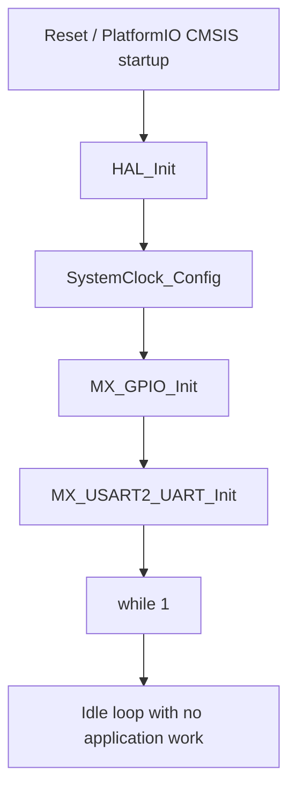

# Controller Firmware Code Flow

This document describes the current runtime behavior of the controller firmware in `src/controller`.

## Scope

The active controller firmware is built by PlatformIO from:

- `src/controller/main.c`
- `src/controller/scenes.c`
- `src/controller/stm32f0xx_hal_msp.c`
- `src/controller/stm32f0xx_it.c`
- `include/controller/main.h`
- `include/controller/scenes.h`
- `include/controller/stm32f0xx_it.h`

Shared STM32 configuration comes from:

- `config/stm32/stm32f0xx_hal_conf.h`
- `ldscripts/STM32F070C6Tx_FLASH.ld`
- PlatformIO-managed STM32Cube/CMSIS packages

The archived STM32CubeMX export remains under `legacy/cubemx/controller`, but it is no longer part of the active build.

The controller still contains only a minimal application skeleton. There is no active scene engine wired into the boot path, no UART receive path, and no logic in the main loop beyond idle spinning.

## Module Map

- `src/controller/main.c`: boot sequence, peripheral initialization, empty forever loop
- `include/controller/main.h`: board pin definitions, including `RS485_TX_EN_Pin`
- `src/controller/scenes.c`: placeholder `Scenes` data structure
- `include/controller/scenes.h`: design notes for future scene handling
- `src/controller/stm32f0xx_it.c`: default interrupt handlers
- `src/controller/stm32f0xx_hal_msp.c`: peripheral MSP setup for GPIO/UART

## Startup Flow

## Detailed Flow

### 1. Reset and HAL startup

After reset, the PlatformIO STM32Cube startup code transfers control into `main()`. The first runtime step is `HAL_Init()`, which resets peripherals, initializes Flash state, and starts the HAL tick infrastructure.

### 2. Clock configuration

`SystemClock_Config()` configures the MCU to run directly from HSI with no PLL. This creates the baseline timing used by HAL delays and the configured peripherals.

### 3. GPIO initialization

`MX_GPIO_Init()` currently enables GPIOA and configures one output:

- `RS485_TX_EN_Pin` on GPIOA pin 7

The pin is driven low during initialization, which implies the RS485 transmitter is disabled by default.

### 4. UART initialization

`MX_USART2_UART_Init()` configures `USART2` as:

- `115200` baud
- `9` data bits
- even parity
- `1` stop bit

That framing matches the client firmware configuration, but the controller does not currently transmit or receive anything after init.

### 5. Main loop

The forever loop in `main()` is empty. Once initialization completes, the controller spends all runtime in an idle busy-loop with no state updates, no scene evaluation, and no protocol handling.

## Scene Model Placeholder

`scenes.c` defines a `struct Scenes` with four address arrays:

- `in_address`: addresses that trigger a scene
- `on_on_out_addresses`: outputs to turn on when the scene activates
- `on_off_out_addresses`: outputs to turn off when the scene activates
- `off_out_addresses`: outputs to turn off when the scene deactivates

This type is compiled into the firmware now, but it is still not exposed as a usable API, instantiated anywhere, or connected to the controller boot path. It remains a design stub rather than active firmware behavior.

## Interrupt Flow

The controller interrupt file contains the default Cortex-M handlers and no configured `USART2_IRQHandler()`. In practice:

- SysTick increments the HAL tick
- fault handlers trap in infinite loops
- no application-level serial receive flow is currently implemented

## What Is Missing

The controller-side application architecture appears intended to manage scenes and drive RS485 communication, but those pieces are not yet present in the active code path. To turn this into a functioning controller, the next implementation layer would need:

- a protocol parser or transmitter on `USART2`
- scene state storage and evaluation logic
- a scheduler or main-loop task model
- a link between received commands and scene/output actions
