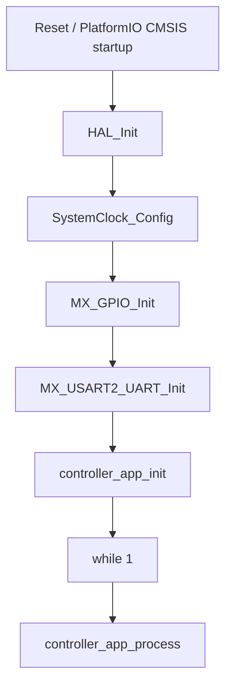

# Controller Firmware Code Flow

This document describes the current runtime behavior of the controller firmware in `src/controller`.

## Scope

The active controller firmware is built by PlatformIO from:

- `src/controller/main.c`
- `src/controller/controller_app.c`
- `src/controller/controller_bus.c`
- `src/controller/controller_inputs.c`
- `src/controller/scene_engine.c`
- `src/controller/scene_table.c`
- `src/controller/stm32f0xx_hal_msp.c`
- `src/controller/stm32f0xx_it.c`
- `include/controller/controller_app.h`
- `include/controller/controller_bus.h`
- `include/controller/controller_inputs.h`
- `include/controller/main.h`
- `include/controller/scene_engine.h`
- `include/controller/scene_table.h`
- `include/controller/stm32f0xx_it.h`

Shared STM32 configuration comes from:

- `config/stm32/stm32f0xx_hal_conf.h`
- `ldscripts/STM32F070C6Tx_FLASH.ld`
- PlatformIO-managed STM32Cube/CMSIS packages

The archived STM32CubeMX export remains under `legacy/cubemx/controller`, but it is no longer part of the active build.

The controller now owns local input polling, scene state, and RS485 transmit-side orchestration. It still has no receive-side UART parser.

## Module Map

- `src/controller/main.c`: boot sequence and handoff into `controller_app`
- `src/controller/controller_app.c`: top-level application composition
- `src/controller/controller_bus.c`: RS485 frame transmission
- `src/controller/controller_inputs.c`: local button GPIO init and debounce
- `src/controller/scene_engine.c`: trigger-to-scene execution
- `src/controller/scene_table.c`: static scene and binding definitions
- `include/controller/main.h`: board pin definitions, including `RS485_TX_EN_Pin`
- `src/controller/stm32f0xx_it.c`: default interrupt handlers
- `src/controller/stm32f0xx_hal_msp.c`: peripheral MSP setup for GPIO/UART

## Startup Flow

## Detailed Flow

### 1. Reset and HAL startup

After reset, the PlatformIO STM32Cube startup code transfers control into `main()`. The first runtime step is `HAL_Init()`, which resets peripherals, initializes Flash state, and starts the HAL tick infrastructure.

### 2. Clock configuration

`SystemClock_Config()` configures the MCU to run directly from HSI with no PLL. This creates the baseline timing used by HAL delays and the configured peripherals.

### 3. GPIO initialization

`MX_GPIO_Init()` enables GPIOA and configures the controller RS485 direction pin:

- `RS485_TX_EN_Pin` on GPIOA pin 7

The pin is driven low during initialization, so the RS485 transmitter is disabled by default.

### 4. UART initialization

`MX_USART2_UART_Init()` configures `USART2` as:

- `115200` baud
- `9` data bits
- even parity
- `1` stop bit

The controller currently uses this UART for transmit-side protocol traffic only.

### 5. Application startup

`controller_app_init()` wires together three controller-specific modules:

- `controller_bus`: stores the UART handle used for RS485 transmission
- `controller_inputs`: initializes the local controller button GPIO
- `scene_engine`: resets scene state through `scene_table`

### 6. Main loop

`controller_app_process()` polls the local controller button. When a debounced press is detected, it:

1. resolves the `(source_node_id, button_id)` pair through `scene_table`
2. toggles the matching scene state
3. sends one `PROTOCOL_CMD_SET_OUTPUT_STATE` frame per mapped output through `controller_bus`

## Scene Model

The controller scene data now lives in `scene_table.c`:

- `ButtonBinding`: maps a source node/button pair to a scene ID
- `SceneOutput`: maps a scene to one target node/output pair
- `SceneDefinition`: tracks current scene state plus its output list

`scene_engine.c` owns the logic that turns a trigger into scene state changes and outbound output commands.

## Interrupt Flow

The controller interrupt file contains the default Cortex-M handlers and no configured `USART2_IRQHandler()`. In practice:

- SysTick increments the HAL tick
- fault handlers trap in infinite loops
- no application-level serial receive flow is currently implemented

## Remaining Gaps

The controller still needs:

- a receive-side UART parser if nodes must report back beyond button-press messages
- acknowledgement or retry behavior on the bus
- dynamic scene configuration or persistence if scenes should not stay hard-coded
